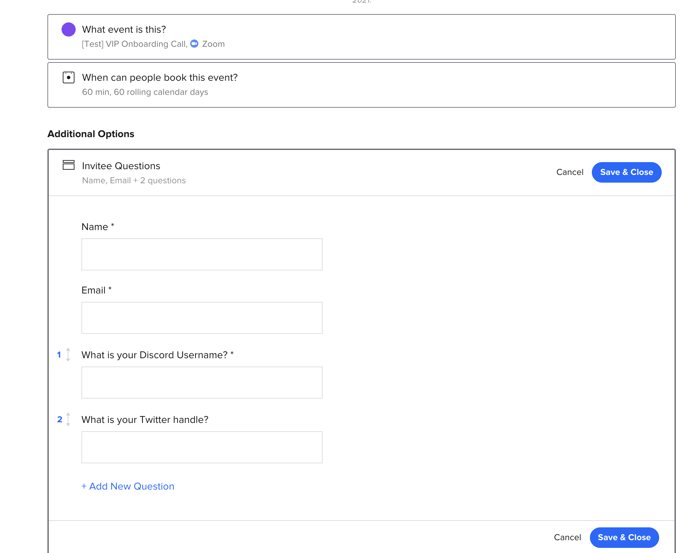
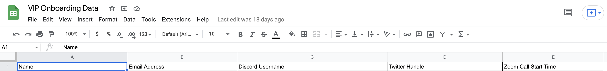
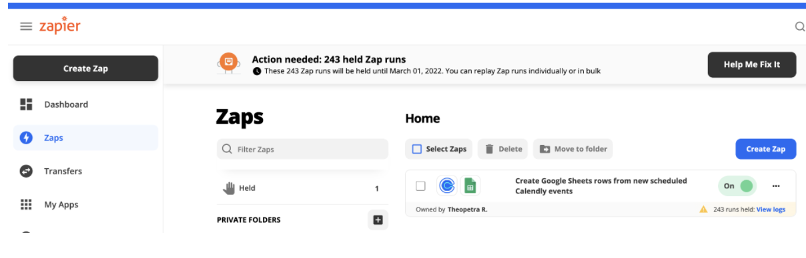
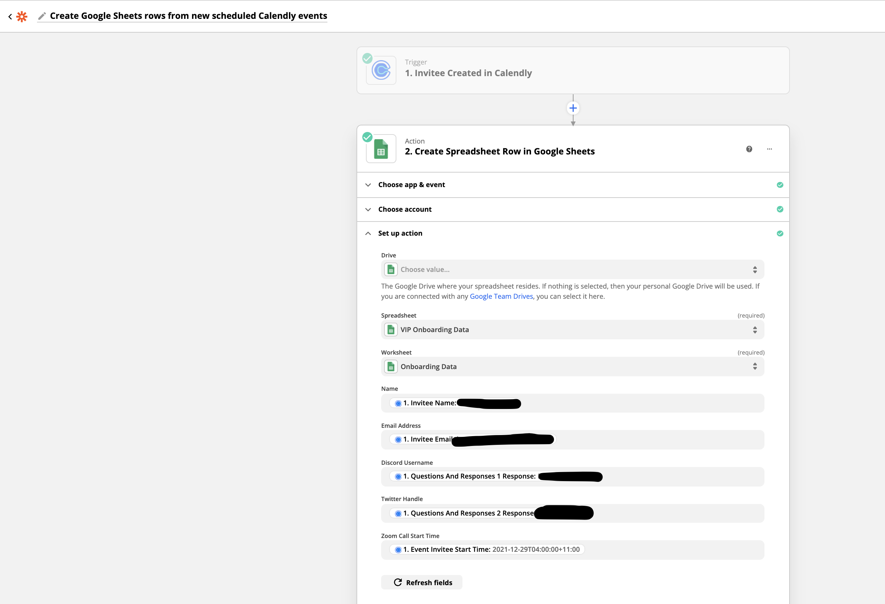
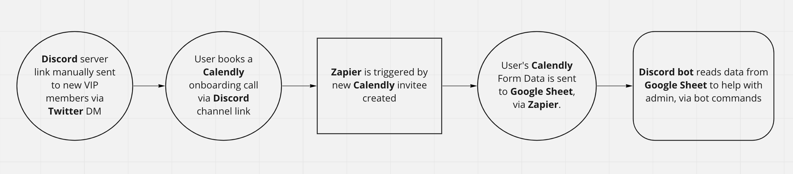

## About

The purpose of this bot is to automate the onboarding process of users into the DAO.

## Set Up

You must create a Discord Bot account, create a new application, and invite your bot to the server you want it to run in. To do this, follow the instructions here: https://www.freecodecamp.org/news/create-a-discord-bot-with-javascript-nodejs/

Create `.env` file and complete the required environment variables specified in .env.example.

The bot is currently hosted on Heroku. The same environment variables in your .env
file must also be specified within Heroku's config settings via the Heroku dashboard.

The flow works like this:

1. User is manually selected as a VIP member and sent the Discord server link via Twitter DM to join the DAO.
2. User books a Calendly onboarding call via the Discord channel link.
3. User's Calendly form data is automatically sent to a Google Sheet. For this to work, the Calendly event settings must collect this data, in this exact order:

   

   Next, create a Google Sheet for the Calendly form data to be stored in, with these exact headers, in this order (Name, Email Address, Discord Username, Twitter Handle, Zoom Call Start Time):

   

   Finally, create a Zapier account with the following trigger/zap, to send the Calendly form data to the above Google Sheet:

   

   

4. Discord admin uses Discord Bot commands in the channel that has bot permissions, to view Discord users who have not booked a call (!notbooked) and to send those users a reminder message (!notify) (process.env.CHANNEL_NAME_WITH_BOT_PERMISSION must be specified, and the bot will only work in that channel).

## Architecture



## Running the Bot

To run locally:

```
npm install
npm start
```

To deploy to Heroku for the first time, follow the instructions here: https://dev.to/vishnudileesh/host-nodejs-discord-bot-for-free-1hg3

To re-deploy manually:

```
npm run deploy
```

## Bot Commands

- !help - returns a list of valid commands.
- !notbooked - returns which Discord users have not booked an onboarding call.
- !notify - sends a message to each Discord user without a booked onboarding call, reminding them to book.

## Useful Guides to Re-Create this Bot from Scratch

- How to Use Google Sheets API with Node.js: https://hackernoon.com/how-to-use-google-sheets-api-with-nodejs-cz3v316f
- Create a Google Cloud project: https://hackernoon.com/how-to-use-google-sheets-api-with-nodejs-cz3v316f
- How to Build a Discord Bot with Node.js: https://www.digitalocean.com/community/tutorials/how-to-build-a-discord-bot-with-node-js
- How to Host a node.js Discord Bot for Free, using Heroku: https://dev.to/vishnudileesh/host-nodejs-discord-bot-for-free-1hg3
- Discord's API Docs: https://discord.com/developers/docs/resources/guild
- discord.js package: https://discord.js.org/#/
- JavaScript Discord Bot Tutorial: https://www.freecodecamp.org/news/create-a-discord-bot-with-javascript-nodejs/
